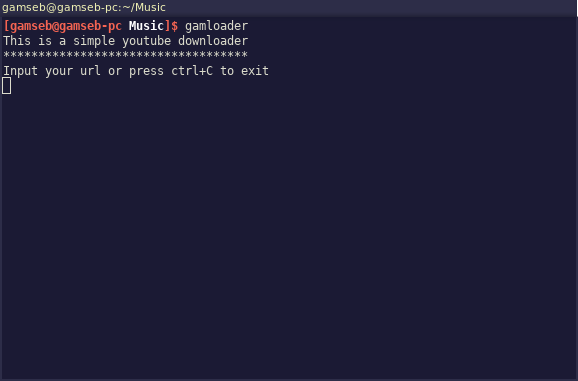

<h1>Youtube-dl based script for easy download from youtube</h1>

This is a simple script I have written in python to facilitate the download of youtube videos. In order to use it, you need to install the dependencies.

<ol><strong>How to use the script on linux:</strong>
<li>Open the terminal</li>
<li><strong>CD</strong> to the directory where we want to download to</li>
<li>Type <strong>python3</strong> into the console followed wit the name of the download script <strong>.py</strong> file. Then press enter</li>
<li>Into the command prompt you need to copy the <strong>url</strong> of the youtube video</li>
<li>Repeat as many times as you like</li>
<li>Quit the script with <strong>ctrl-C or end</strong></li>
</ol>
<h2>Dependencies:</h2>
<ul>
  <li><a href="https://rg3.github.io/youtube-dl/">youtube-dl</a></li>
  <li>ffmpeg</li>
</ul>
